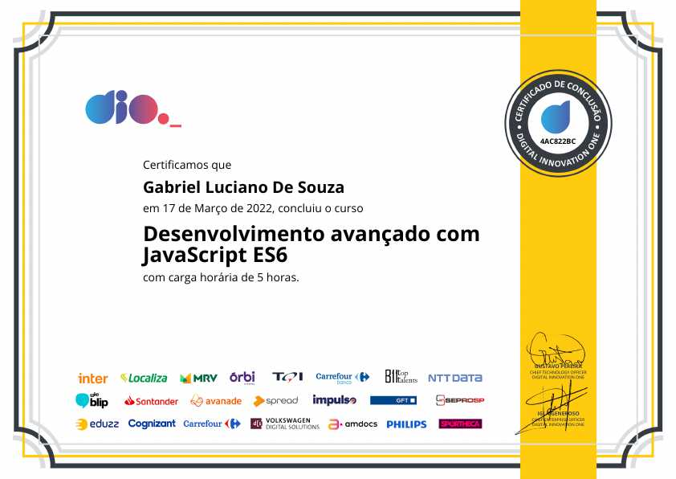
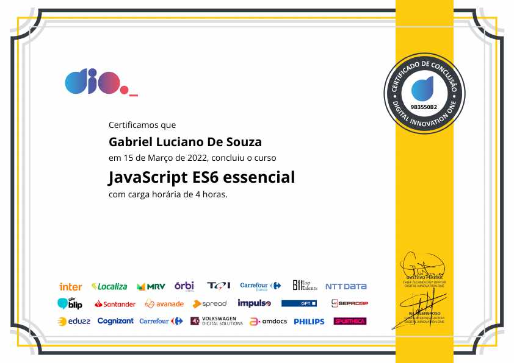
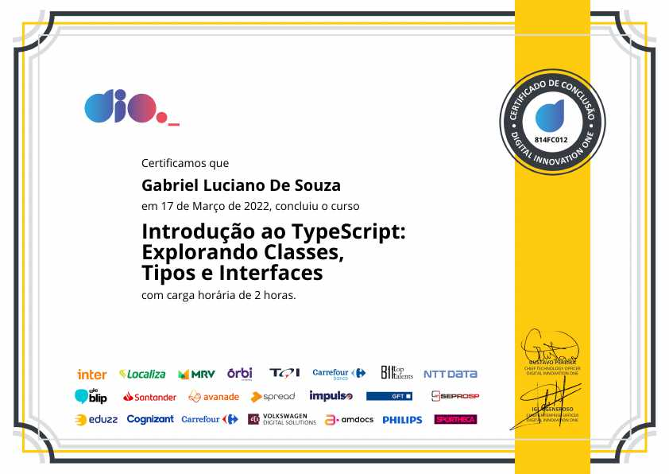

# Certificates

This repository contains a list of the certificates from the courses I have completed organized by institution and arranged in alphabetical order.

_Leia em português: [Português Brasileiro](README.md)._

**Browse by Institution**

- [Digital Innovation One - DIO](#digital-innovation-one)
- [Udemy](#udemy)

## Digital Innovation One

### Advanced development with ES6 JavaScript

- **Modality**: Online
- **Institution**: [Digital Innovation One](https://www.dio.me/)
- **Repository**: [javascript-es6-avancado](https://github.com/gabrielluciano/cursos-dio/tree/main/cursos/javascript-es6-avancado)
- **Emission date**: March 17, 2022.
- **Certificate Link**: [4AC822BC](https://www.dio.me/certificate/4AC822BC)

View certificate

### Agile Projects with SCRUM

- **Modality**: Online
- **Institution**: [Digital Innovation One](https://www.dio.me/)
- **Repository**: [projetos-ageis-com-scrum](https://github.com/gabrielluciano/cursos-dio/tree/main/cursos/projetos-ageis-com-scrum)
- **Emission date**: March 14, 2022.
- **Certificate Link**: [A7748975](https://www.dio.me/certificate/A7748975)

View certificate

### Essential ES6 JavaScript

- **Modality**: Online
- **Institution**: [Digital Innovation One](https://www.dio.me/)
- **Repository**: [javascript-es6-essencial](https://github.com/gabrielluciano/cursos-dio/tree/main/cursos/javascript-es6-essencial)
- **Emission date**: March 15, 2022.
- **Certificate Link**: [9B3550B2](https://www.dio.me/certificate/9B3550B2)

View certificate

### Essential Programming Logic

- **Modality**: Online
- **Institution**: [Digital Innovation One](https://www.dio.me/)
- **Emission date**: March 9, 2022.
- **Certificate Link**: [9B04E3C0](https://www.dio.me/certificate/9B04E3C0)

View certificate

### Introduction to Git and GitHub

- **Modality**: Online
- **Institution**: [Digital Innovation One](https://www.dio.me/)
- **Repository**: [introducao-ao-git](https://github.com/gabrielluciano/cursos-dio/tree/main/cursos/introducao-ao-git)
- **Emission date**: March 14, 2022.
- **Certificate Link**: [350E8910](https://www.dio.me/certificate/350E8910)

View certificate

### Introduction to ReactJS

- **Modality**: Online
- **Institution**: [Digital Innovation One](https://www.dio.me/)
- **Repository**: [introducao-ao-reactjs](https://github.com/gabrielluciano/cursos-dio/tree/main/cursos/introducao-ao-reactjs)
- **Emission date**: March 19, 2022.
- **Certificate Link**: [A3EF7ABE](https://www.dio.me/certificate/A3EF7ABE)

View certificate

### Introduction to TypeScript: Exploring Classes, Types and Interfaces

- **Modality**: Online
- **Institution**: [Digital Innovation One](https://www.dio.me/)
- **Repository**: [introducao-ao-typescript](https://github.com/gabrielluciano/cursos-dio/tree/main/cursos/introducao-ao-typescript)
- **Emission date**: March 17, 2022.
- **Certificate Link**: [814FC012](https://www.dio.me/certificate/814FC012)

View certificate

### Introduction to website creation with HTML5 and CSS3

- **Modality**: Online
- **Institution**: [Digital Innovation One](https://www.dio.me/)
- **Repository**: [introducao-ao-html5-e-css3](https://github.com/gabrielluciano/cursos-dio/tree/main/cursos/introducao-ao-html5-e-css3)
- **Emission date**: March 15, 2022.
- **Certificate Link**: [B078A23D](https://www.dio.me/certificate/B078A23D)

View certificate

## Udemy

### Complete Modern Web Course with JavaScript 2021 + Projects

- **Modality**: Online
- **Institution**: [Udemy](https://www.udemy.com/course/curso-web)
- **Repository**: [gabrielluciano/curso-web-moderno-cod3r](https://github.com/gabrielluciano/curso-web-moderno-cod3r)
- **Emission date**: March 8, 2022.
- **Certificate Link**: [UC-cfcfd4ed-7c23-418d-9aba-26945c3450ef](https://www.udemy.com/certificate/UC-cfcfd4ed-7c23-418d-9aba-26945c3450ef/)

View certificate

