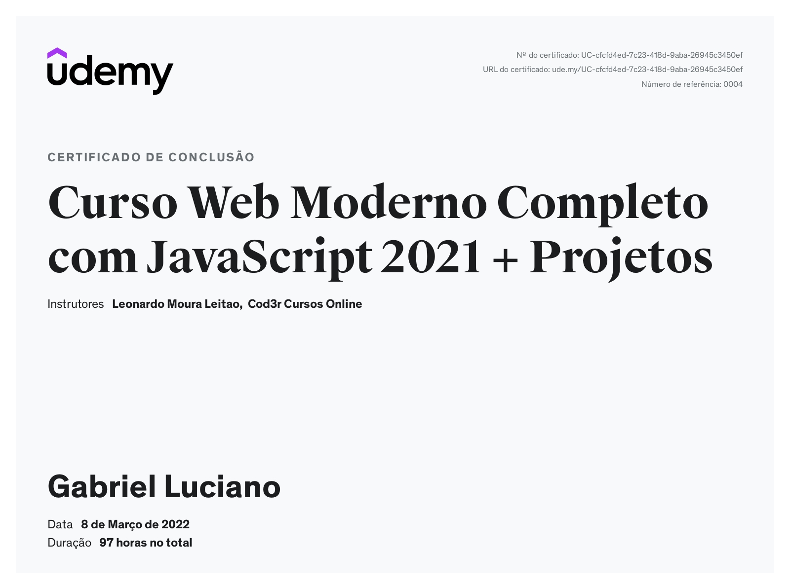

# Certificados

Este repositório contém uma lista com os certificados dos cursos que concluí organizados em ordem alfabética.

*Read this in English: [English](README.en.md).*

## Curso Web Moderno Completo com JavaScript 2021 + Projetos

- **Modalidade**: Online
- **Instituição**: [Udemy](https://www.udemy.com/course/curso-web)
- **Repositório**: [gabrielluciano/curso-web-moderno-cod3r](https://github.com/gabrielluciano/curso-web-moderno-cod3r)
- **Data da emissão**: 08 de março de 2022.
- **Link do Certificado**: [UC-cfcfd4ed-7c23-418d-9aba-26945c3450ef](https://www.udemy.com/certificate/UC-cfcfd4ed-7c23-418d-9aba-26945c3450ef/)

Ver certificado

