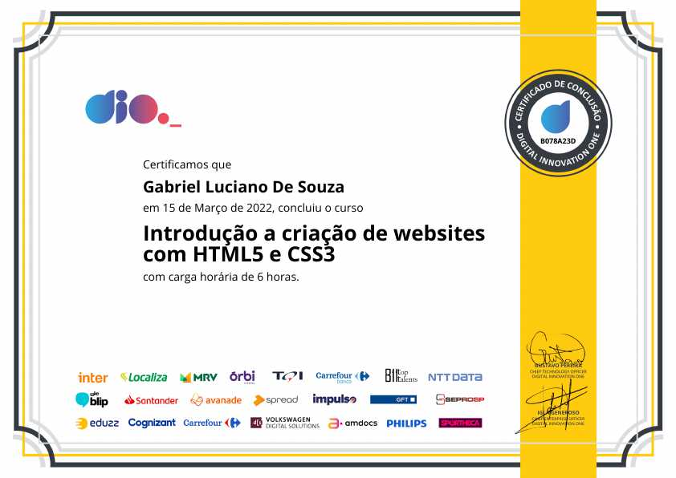
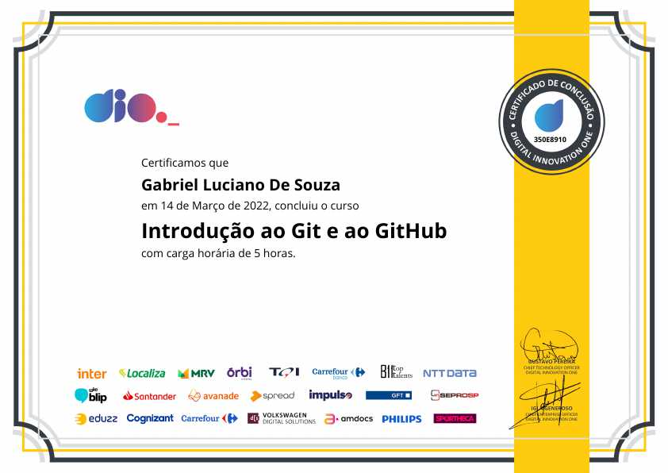
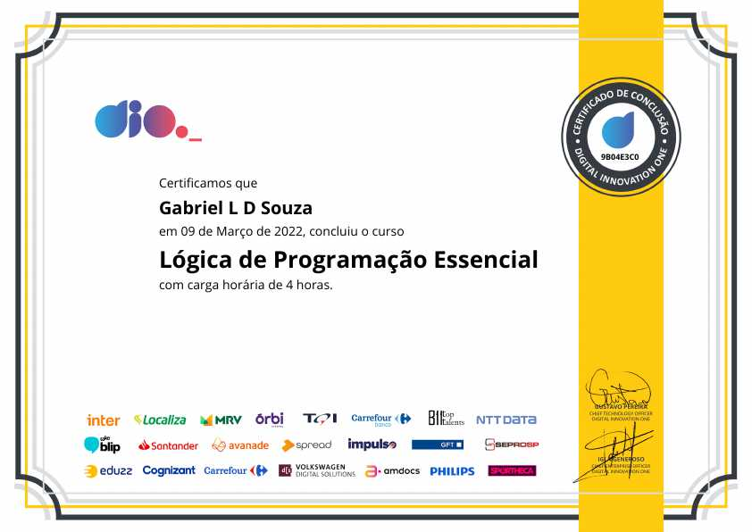
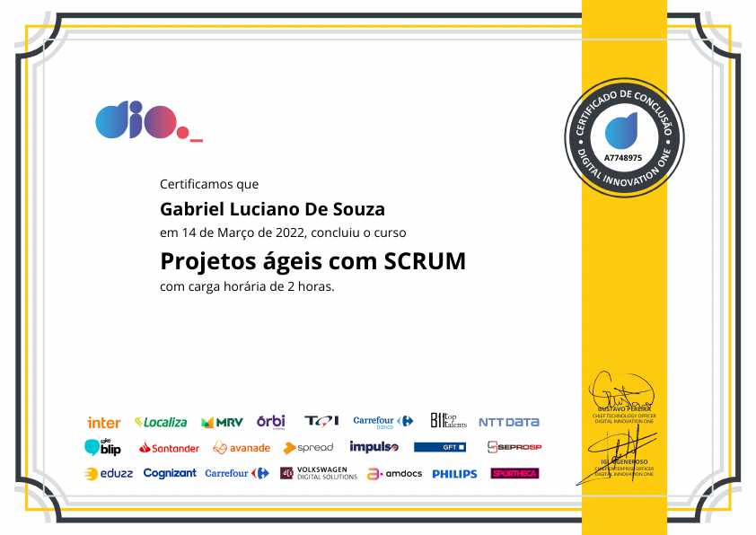
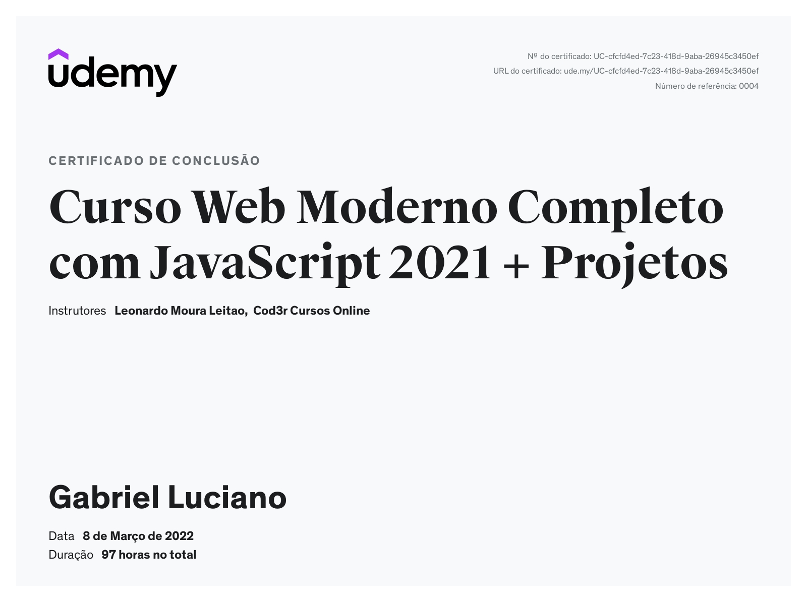

# Certificados

Este repositório contém uma lista com os certificados dos cursos que concluí organizados por instituição e dispostos em ordem alfabética.

*Read this in English: [English](README.en.md).*

**Navegue por instituição**

- [Digital Innovation One - DIO](##digital-innovation-one)
- [Udemy](##udemy)

## Digital Innovation One

### Introdução a criação de websites com HTML5 e CSS3

- **Modalidade**: Online
- **Instituição**: [Digital Innovation One](https://www.dio.me/)
- **Repositório**: [introducao-ao-html5-e-css3](https://github.com/gabrielluciano/cursos-dio/tree/main/cursos/introducao-ao-html5-e-css3)
- **Data da emissão**: 15 de março de 2022.
- **Link do Certificado**: [B078A23D](https://www.dio.me/certificate/B078A23D)

Ver certificado

### Introdução ao Git e ao GitHub

- **Modalidade**: Online
- **Instituição**: [Digital Innovation One](https://www.dio.me/)
- **Repositório**: [introducao-ao-git](https://github.com/gabrielluciano/cursos-dio/tree/main/cursos/introducao-ao-git)
- **Data da emissão**: 14 de março de 2022.
- **Link do Certificado**: [350E8910](https://www.dio.me/certificate/350E8910)

Ver certificado

### Lógica de Programação Essencial

- **Modalidade**: Online
- **Instituição**: [Digital Innovation One](https://www.dio.me/)
- **Data da emissão**: 09 de março de 2022.
- **Link do Certificado**: [9B04E3C0](https://www.dio.me/certificate/9B04E3C0)

Ver certificado

### Projetos Ágeis com SCRUM

- **Modalidade**: Online
- **Instituição**: [Digital Innovation One](https://www.dio.me/)
- **Repositório**: [projetos-ageis-com-scrum](https://github.com/gabrielluciano/cursos-dio/tree/main/cursos/projetos-ageis-com-scrum)
- **Data da emissão**: 14 de março de 2022.
- **Link do Certificado**: [A7748975](https://www.dio.me/certificate/A7748975)

Ver certificado

## Udemy

### Curso Web Moderno Completo com JavaScript 2021 + Projetos

- **Modalidade**: Online
- **Instituição**: [Udemy](https://www.udemy.com/course/curso-web)
- **Repositório**: [gabrielluciano/curso-web-moderno-cod3r](https://github.com/gabrielluciano/curso-web-moderno-cod3r)
- **Data da emissão**: 08 de março de 2022.
- **Link do Certificado**: [UC-cfcfd4ed-7c23-418d-9aba-26945c3450ef](https://www.udemy.com/certificate/UC-cfcfd4ed-7c23-418d-9aba-26945c3450ef/)

Ver certificado

